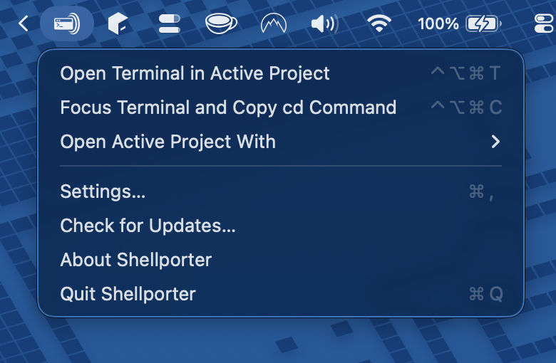

# Shellporter

A macOS menu bar utility that opens a terminal in the project directory of the active IDE window — with a single hotkey press.

[Website](https://shellporter.com) · [Releases](https://github.com/prof18/shellporter/releases)

<p align="center">
  
</p>

## Requirements

- macOS 14 or later
- Accessibility permission (the app will prompt you on first launch)

## Installation

Download the latest Shellporter DMG directly from [GitHub Releases](https://github.com/prof18/shellporter/releases/latest/download/Shellporter.dmg).

Open the DMG and drag `Shellporter.app` to Applications. The zip asset is used for Sparkle automatic updates.

## Usage

1. Launch Shellporter — it appears as an icon in the menu bar
2. Grant Accessibility permission when prompted (required to read IDE window info)
3. Focus your IDE and press `Ctrl+Opt+Cmd+T` (`^⌥⌘T`) to open a terminal at the project directory
4. Use `Ctrl+Opt+Cmd+C` (`^⌥⌘C`) to copy the `cd` command to the clipboard instead

Open **Settings** from the menu bar icon to change the default terminal, customize hotkeys, or set a custom command template.

## Motivation

I work with multiple projects at the same time, and usually I have one Desktop/Workspace on macOS per project with my IDE and a terminal window. I prefer using my terminal app instead of the terminal included in the IDE because TUIs of AI agents usually perform better in a standalone terminal without scrolling jank and jumps.

But I'm lazy, and having to open a new terminal window and navigate to the project path every time is a lot of friction. So I built this tool that lets me open the current project directly in a new window of my favourite terminal.

## Features

- Lives in the menu bar — no dock icon, no clutter
- Global hotkey (`Ctrl+Opt+Cmd+T` (`^⌥⌘T`)) to open a terminal at the active project's directory
- Second hotkey (`Ctrl+Opt+Cmd+C` (`^⌥⌘C`)) to copy the `cd` command to the clipboard
- Automatic project directory detection via Accessibility APIs, window titles, and IDE metadata files
- Resolution cache for instant recall even when live strategies fail
- Configurable hotkeys, terminal preference, and per-terminal launch behavior

### Supported IDEs

- JetBrains IDEs (IntelliJ IDEA, Android Studio, Fleet, etc.)
- VS Code / VS Code Insiders / VSCodium
- Cursor
- Antigravity
- Xcode

### Supported Terminals

- Terminal.app
- iTerm2 (with session reuse — re-invocation selects an existing session instead of opening a duplicate; new unmatched launches can use windows or tabs)
- Ghostty (single-instance or new-window mode). Ghostty 1.3+ uses AppleScript for new windows inside the existing app instance; older versions fall back to `open -na`
- Kitty (single-instance mode)
- Custom command (any terminal via a user-provided shell command template)

## How It Works

When you press the hotkey, Shellporter:

1. Identifies the frontmost IDE and its window
2. Reads the window title and document attributes via the macOS Accessibility API
3. Runs a chain of resolution strategies tailored to each IDE family (title parsing, IDE metadata files like `recentProjects.xml` or `storage.json`, AX document attributes)
4. Normalizes the resolved path to the project root (walking up past individual files, `.xcodeproj` bundles, etc.)
5. Opens your configured terminal at that directory

If all live strategies fail, a resolution cache provides instant fallback from a previous successful resolution. If nothing works, a manual folder picker appears as a last resort.

### Why Accessibility Permission Is Required

Shellporter needs the macOS Accessibility permission to read window titles and document attributes from IDE windows via the `AXUIElement` API. This is the only way to figure out which project is open in the frontmost window without each IDE providing a dedicated integration. The app will prompt you to grant this permission on first launch — it only reads window info and never modifies anything.

## Troubleshooting

**The hotkey does nothing:**

1. Confirm that Shellporter is running (look for its icon in the menu bar)
2. Check that Accessibility permission is granted in **System Settings → Privacy & Security → Accessibility**
3. Try clicking the menu bar icon and using the command from there — if that works, the hotkey may conflict with another app

**The wrong project directory opens:**

- Use **Copy Last Resolution Diagnostics** from the menu bar to inspect which strategy resolved the path and what candidates were considered
- This is also useful info to include when [opening an issue](https://github.com/prof18/shellporter/issues)

## Privacy

Shellporter runs entirely on your Mac. It does not collect analytics, phone home, or send any data over the network. The Accessibility permission is used solely to read window titles and document attributes from the frontmost IDE in order to resolve project paths. All diagnostics and logs are stored locally on your machine.

## Documentation

For a detailed look at the architecture, resolver pipeline, and terminal launch mechanics, see the [Technical Overview](docs/technical-overview.md).

## Building from Source

Requires Swift 6.2+ and macOS 14+.

```bash
# Build and run (dev loop)
./Scripts/compile_and_run.sh

# Build and run as Shellporter Dev.app alongside Shellporter.app
./Scripts/compile_and_run.sh --dev

# Build and run with tests
./Scripts/compile_and_run.sh --test

# Quick build / test only
swift build
swift test
```

## License

```
Copyright 2026 Marco Gomiero

Licensed under the Apache License, Version 2.0 (the "License");
you may not use this file except in compliance with the License.
You may obtain a copy of the License at

    http://www.apache.org/licenses/LICENSE-2.0
```
